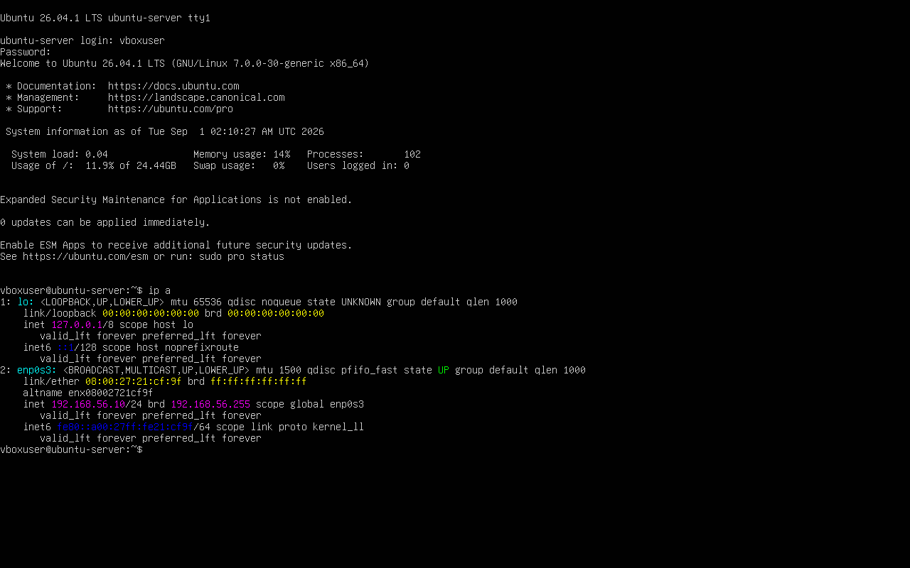
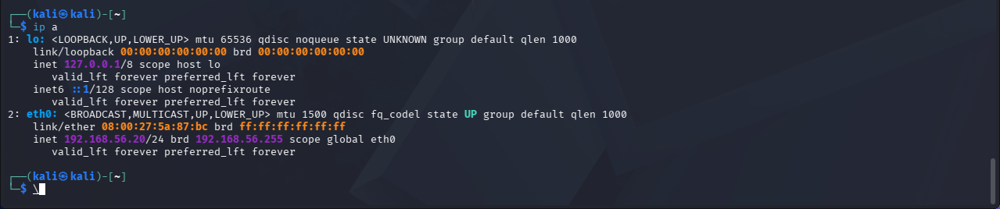

# Lab 01: Host-Only Lab Network Setup

## Objective
Set up an isolated host-only virtual network in VirtualBox connecting an Ubuntu Server 
VM and a Kali Linux VM, to serve as the foundation for further networking and security labs.

## Topology
Kali Linux (192.168.56.20) <--> VirtualBox Host-Only Network (192.168.56.0/24) <--> Ubuntu Server (192.168.56.10)

## Steps
1. Created a VirtualBox Host-Only network (`vboxnet0`) to isolate lab traffic from the 
   home network and internet.
2. Attached both VMs' network adapters to the Host-Only network with "Virtual Cable 
   Connected" enabled.
3. Assigned a static IP on Ubuntu Server via Netplan (`/etc/netplan/`).
4. Assigned a static IP on Kali Linux — initially attempted via `/etc/network/interfaces`.
5. Verified connectivity between both VMs with `ping`.

## Troubleshooting
While configuring the static IP on Kali, `sudo ifdown eth0 && sudo ifup eth0` returned 
`Error: ipv4: Address not found`, and `systemctl restart networking` did not apply the 
config either. This pointed to a conflict between the legacy `ifupdown`/`interfaces` 
method and NetworkManager, which was actively managing the interface on this Kali build. 
[Add your resolution here once you confirm the nmcli fix — what you ran and why it worked.]

## Result
Ubuntu Server (192.168.56.10) and Kali Linux (192.168.56.20) successfully communicate 
over the isolated host-only network, confirmed via ping with 0% packet loss.

## Screenshots

**Ubuntu Server — interface with static IP assigned**

**Kali Linux — interface with static IP assigned**

**Successful ping between both VMs**

